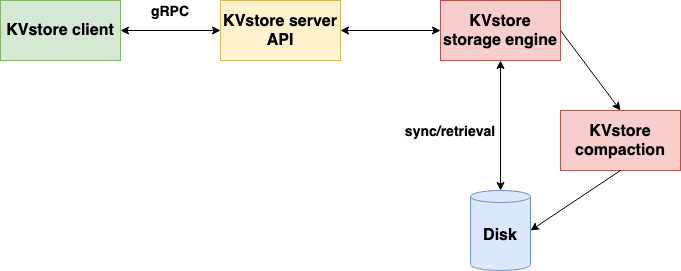

# CrabeDB - A simple, yet mighty, KV store written in Rust.


This is the **Norwegian Monster Crab** for you dear rustaceans !

This key-value store is meant to be fast and reliable from a memory leakage point of view but also for data recovery. It implements the following features :

* Client side :
    * get, set, remove operations.
    * gRPC network API for a blazingly-fast request/response transfer time.

* Server side :
    * Tokio runtime for bare-metal network performance.
    * Concurrent access to memory via locking mechanism.
    * Disk synchronization using Log-Structured-Merging (LSM)
    * Data compaction in the background (if files are large enough).
    * [WIP] Telemetry interface for Prometheus.


Now, let's see the architecture :



The client/server part is quite straightforward and doesn't really deserve an in-depth explanation. However, it could be interesting to better describe the storage engine which is worth taking a bit of supplementary time.

## Filesystem organization of the storage engine (**src/crabedb/storage**)

* **crabe_db** : The public structures are located here. The CrabeDB and its Options are available here as with the higher level logic like get, set, remove and synchronization/compaction threads. All the memory slot allocation details are defined in appropriated modules.
* **slot** : This module define the memory model used to store the key/value couple. As you can see the access to a **CrabeDBInternal** instance (and consequently a **MemIdx** instance embedding the HashMap storing the entries) is wrapped inside a thread-safe reference-counting pointer (Arc) which means that, using a locking mechanism, the operation on the memory allows concurrency. We can thus have multiple clients safely accessing the same resources on the same server without any data races. You will see that our "memory" (`CrabeDB::CrabeDBInternal::MemIdx`) store the keys but its values aren't directly the encoded string values but rather a `MemIdxEntry` which wraps metadata information on where to find/write the value using a Log-Structured-Merge encoder/decoder. This approach is inspired by the works on the hugely successful Key/Value stores like LevelDB and RocksDB. However, we surely don't match their performances and our implementation hasn't been thought to be distributed (yet).

* **chunk_queue** : Map a file_id to a list of File objects. It also implement a queueing system with a least recently used eviction policy to remove the right file_id when the size is greater than the capacity.

* **lsm** : Reading a writing the logs in the SSTables and also write to the compaction log (.cpct file) which are used to hint the compaction process on where are the log to compact. We trigger the compaction thread for a set of file (using their file_id) if different factor are met. For example, for a given file_id, we will check the `fragmentation_factor` which is the ratio of dead_entries in a file. If the fragmentation_factor is high (let's say above 40%), we can compact the SSTable in removing the "tombstoned" entries (dead_entries). The compaction can also be trigger if the "dead bytes" threshold is met : it is the ratio of the size of the tombstoned entries. We keep a mapping in memory called `CompactionAnalysis` which link a file_id to its number of dead entries, number of total entries and the size of dead entries.

* **error** : Result wrapper for `std::result::Result` with a custom Error enum type.

* **xxhash** : Wrapper type for the xxhash algorithm, an extremely fast hash algorithm.

* **options** : Define simple structures to store Synchronization and Storage options.

* **util** : Functions that couldn't fit anywhere else...

# Build guide

## Option 1 : Build with Docker
(The docker images are not optimized in size, due to lack of time... But using a builder layer + alpine:latest should offer a size around 30MB for both images.)

### Build

**For the client :**

* You can build it yourself :
    * `docker build -t crabedb-client:alpha -f docker/client.Dockerfile .`

* Or pull it from this repository :
    * `docker pull gabrielmougard/crabedb-client:alpha`


**For the server :**

* You can build it yourself :

    * `docker build -t crabedb-server:alpha -f docker/server.Dockerfile .`

* Or pull it from this repository :

    * `docker pull gabrielmougard/crabedb-server:alpha`


### Networking

Create a docker network:

* `sudo docker network create crabedb_network`

### Run

First, **Run the server :**

```bash
docker run\
--network crabedb_network\
--name crabedbserver -p 5000:5000\
crabedb-server:alpha "./target/debug/crabedb-server <PARAMS>"
```

In order to work in the docker network, you should add the mandatory option `-a 0.0.0.0:5000`.
Of course, if you pull the image from the repository, replace `crabedb-server:alpha` by `gabrielmougard/crabedb-server:alpha`.

(enter `-h` so you can have an overview of the commands.)

**Run the client :**

You need to get the IP address of the server container over the network now.
Just type in `docker inspect <SERVER_CONTAINER_ID> | grep IPAddress`. I have `172.19.0.2` for example.
Then launch the client container with this IP address as the first <node> positionnal argument :

```bash
docker run\
--network crabedb_network\
crabedb-client:alpha "./target/debug/crabedb-client <PARAMS>"
```

Of course, if you pull the image from the repository, replace `crabedb-server:alpha` by `gabrielmougard/crabedb-server:alpha`.

(enter `-h` so you can have an overview of the commands.)


## Option 2 : Build from Cargo

You should have the Rust toolchain installed on your machine with Cargo.

Build with `cargo build --release`

Then the binaries are in `/target/release`

The binaries for the client and server are respectively `crabedb-client` and `crabedb-server` (followed by the extension `.exe` if you are on windows)

NOTE : At least here, you shouldn't have any networking complexities when running the binaries. The <node> argument in the client is 127.0.0.1:5000 and for the server binary, you don't have to enter the `-a` option, it will be 127.0.0.1:5000 by default.