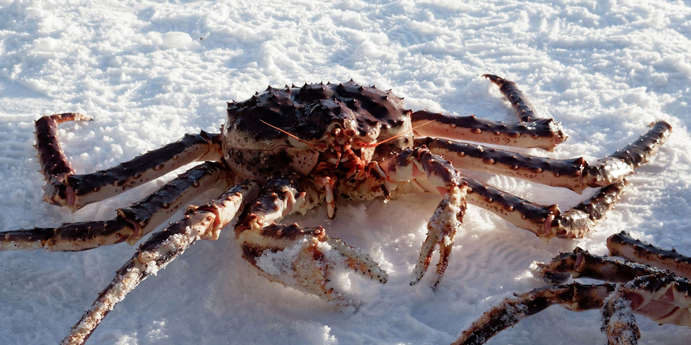

# CrabeDB - A simple, yet mighty, KV store written in Rust.

The **Norwegian Monster Crab** for you dear rustaceans !

## Docker

* For the client :

docker build -t crabe-db-client:latest -f docker/client.Dockerfile .
docker run ...